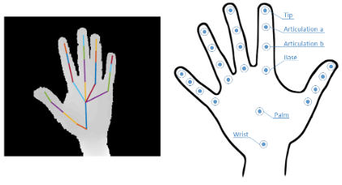

# Deep Learning for Hand Gesture Recognition

This repository holds `Pytorch` implementation of the deep learning model for hand gesture recognition introduced in [Skeletal-Based Dynamic Hand Gesture Recognition](https://drive.google.com/file/d/1pxbCQy3vZ0ni6J_4c2e2VBsHBXWbzU38/view?usp=sharing).

## Getting started

Notebook with the model definition in `pytorch` is provided on Google Colab. The notebook includes gesture data loading, model creation, and model training. For offline use in jupyter, you can download the notebooks from colab.

| Description       | Google Colab                                                                          |
| ----------------- | ------------------------------------------------------------------------------------- |
| 1. Data Loading   | https://colab.research.google.com/drive/1DRSjIKHyppe9kwE9zAxa0dkYo37ZgKbi?usp=sharing |
| 2. Model: PyTorch | https://colab.research.google.com/drive/1GXzWnYWYgXcbkFcvMw2K0FF1NWTaDknm?usp=sharing |

Additional details are provided below.

---

## Model overview

##### Summary

This project centers on dynamic hand gesture recognition through the implementation of recurrent neural networks (RNNs). Specifically, the design involves two distinct RNN models tailored for capturing global motion and Joint Collection Distances (JCD) features, harnessing the inherent capabilities of RNNs in processing sequential data. The investigation delves into three combination approaches -early, intermediate, and late- aimed at optimizing the overall performance of the models.

##### Model input

The input consists of a sequence of frames, with each frame containing the coordinates of 22 joints presented in both 2D and 3D space, creating a detailed representation of a hand skeleton. The data is captured using the Intel RealSense short-range depth camera. These skeletal representations are characterized by their lightweight and sparse nature when compared to image and video representations.

  

##### Extracting features

In the feature extraction step, the model utilizes two key features for dynamic hand gesture recognition. The first feature involves tracking the positions of various hand joints over time, providing insights into the spatial dynamics of gestures and enabling the model to discern unique patterns. Additionally, the Joint Collection Distances (JCD) feature calculates Euclidean distances between pairs of collective hand joints, creating a condensed matrix that encodes relationships between joints.

##### Gesture classification

Once features have been extracted, the model employs various combination techniques to enhance its performance by integrating the two primary features extracted for dynamic hand gestures. The study explores three approaches: early combination, intermediate combination, and late combination. Early combination involves pre-modifying input features before feeding them into a single model. Intermediate combination includes feeding features into two models, combining their results, and then inputting the combined features into a third model. Late combination utilizes algebraic methods such as addition, multiplication, and pairwise maximum to combine features. These approaches are tailored to leverage the synergies between features and optimize the model's effectiveness in classifying dynamic hand gestures.
